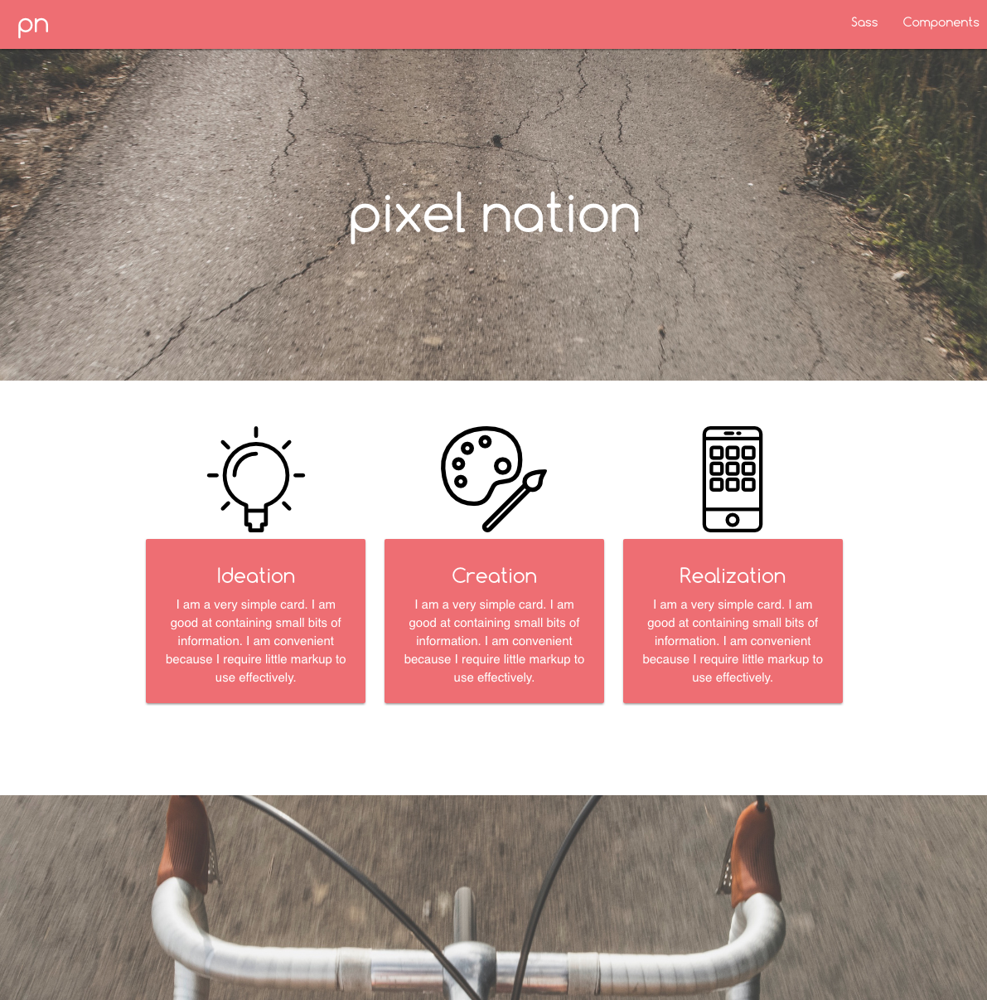

# _[Materialize Practice Site](http://materializecss.com/)_

#### _Materialize responsive PRACTICE, {Nov. 30th, 2016}_

#### By _**Kyle Lange and Jena SanCartier**_

## Description

_This app shows our practice working with Materialize elements such as Paralax, Scrollspy and wave buttons.  The site does not yet have breakpoint media queries for intentionally non-responsive images.  [See it live here.](https://kylelange.github.io/materialize/)_

## Setup/Installation Requirements

  1. Download this repo using your terminal: git clone repo-name pasted here

  2. View the code by drag-and-dropping the file into your [favorite text editor](https://atom.io)

  3. run/check-out the program by dropping the index/html file from your folder into your web browser

### Support & Contact
For questions or comments, please __email [Jena}(jenasancartier@gmail.com) or [Kyle](baronsintrees@gmail.com)__

### Known Issues
_Breakpoints needed for out-of-grid unresponsive elements_

## Technologies Used

* HTML5
* CSS3
* Materialize
* jQuery

### Legal
*Licensed under the GNU General Public License v3.0*

Copyright (c) 2016 **_Jena SanCartier_ & _Kyle Lange_**
